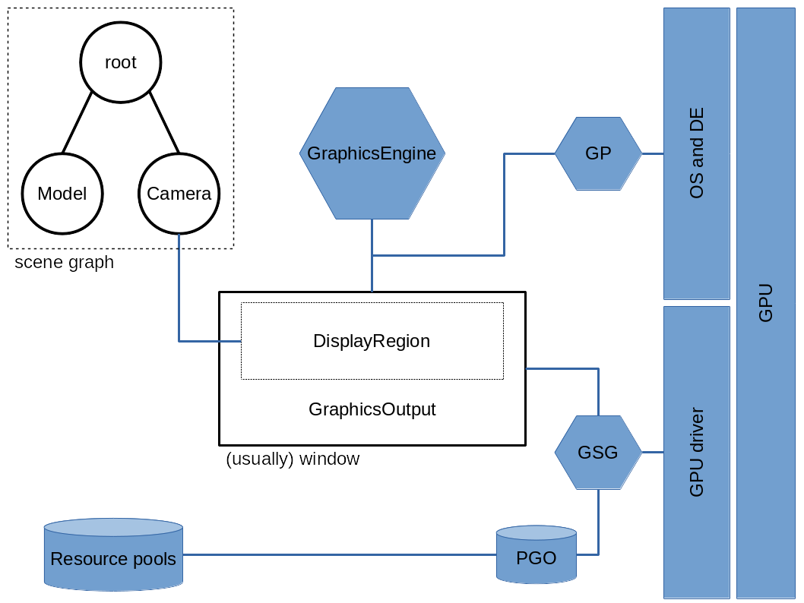

CPU-side rendering
==================

Let us talk about the CPU side of the rendering process which turns our
scene graph(s) into images on the screen. This consists of two steps:
* Setting up the objects that represent the different aspects of the
  process,
* Managing the rendering process.

Again, `ShowBase` does A LOT, especially when it comes to setting up a
sensible boilerplate to start development from.
[Here is a program](./internals.py) that sets it all up without
resorting to `ShowBase`, and gives you most of the vocabulary to talk
about rendering pipelines.

As you have seen, in Panda3D the rendering process is apparently out of
the developer's hands; All that is needed is to call `render_frame()`
and `flip_frame()` on your `GraphicsEngine`. However, while there is a
standardized process for rendering, it is quite configurable; Instead of
calling functions ourselves, we tell Panda3D when during rendering to
call them. What we don't do procedurally, we do declaratively.


Setting up a rendering pipeline
-------------------------------

Let's consider the bits between scene graph on one side, and the
graphics APIs on the other: 

And now let's go over each of them again, following the pattern from the
program earlier (FIXME: Actually, let's not do that. Let's refactor the
code and this explanation into a better common text.): 
* `GraphicsPipelineSelection.getGlobalPtr()` gives you a reference to
  the factory for `GraphicsPipe`s. This is the root from which the API
  side of the rendering pipeline grows.
   * A `GraphicsPipe` is an abstraction over the system's graphics APIs.
    It will later on mostly be used by the `GraphicsEngine`; Its
    [API](https://docs.panda3d.org/1.11/python/reference/panda3d.core.GraphicsPipe)
    is useful to retrieve system information about the system that we
    are working on.
  * When we create a `GraphicsEngine`, we pass a pipe to it that it
    manages a rendering process for; Or we don't, and the GraphicsEngine
    creates a default pipeline itself.
  * Using the `GraphicsEngine`, we create `GraphicsOutput`s, which are
    storage in the form of bitplanes, which can be understood as images.
    A `GraphicsOutput` can be a visible window; If so, actually opening
    (or closing) it does not happen instantly, but during the rendering
    process. Also, the object is of the `GraphicsWindow` type, a
    subclass of `GraphicsOutput`.
* On the scene graph side, there are `Camera`s which have `Lens`es. The
  camera defines a frustum, a pyramid stump of space which represents
  the area that is visible to the camera.
  * The `Camera` has values for the distance of a near plane and a far
    plane, which are the frustum's top and bottom sides.
  * A `Lens` is a projection from 3D into 2D space (and, with
    limitations, back), and like transformations between a `NodePath`
    and its parent, is expressed as a matrix for homogeneous vectors.
  * Each `Lens` may reference a `DisplayRegion` that it draws into; Most
    of the time though, all lenses in a camera draw to the same display
    region, and in fact it is rare for a camera to have more than one
    lens.
* A `DisplayRegion` is the capstone in our setup. It refers to an area
  on a `GraphicsOutput` that a lens draws into, and stores a reference
  to that lens (or, more commonly, a whole camera).


Render pipeline elements
------------------------

And now for some *real* detail:


### `GraphicsOutput` / `GraphicsWindow`

```python
window = graphics_engine.make_output(
    pipe,
    "name",
    sort,
    fb_props,
    win_props,
    flags,
)
```

`pipe` and `"name"` are self-explanatory; `sort` is the FIXME: 

* Framebuffers are data containers in themselves, but can also be set up
  to act as indirections to `Texture` objects. A framebuffer's behavior
  in that regard is controlled with the [`RenderTextureMode`](https://docs.panda3d.org/1.10/python/reference/panda3d.core.GraphicsOutput#_CPPv417RenderTextureMode)
  flags.
  * `FrameBufferProperties`
  * Ignore the `FrameMode` enum. It is used from the C++ end in
    `begin_frame`. Parasitic buffers are deprecated; They were a method
    of simulating buffers on hardware which didn't support them, by
    using a Texture instead.
* [`GraphicsWindow`]: FIXME
  * Managing WindowProperties
  * unexposedDraw
  * I/O devices
  * events
* [`WindowProperties`](https://docs.panda3d.org/1.10/python/reference/panda3d.core.WindowProperties)
  is a specification about a window's state, either created from scratch
  (with or without system-specified default values), or retrieved from a
  window to inspect its current state, or "cloned" from another such
  object. The latter case usually happens to manipulate the current
  state in a specific, limited way; As the `WindowProperties` gotten
  from the window is a constant, a new one is created from it,
  manipulated, and then requested.

  The "raw mice" interface is deprecated; Use `InputDeviceManager`
  instead.
  * Title, undecorated, icon filename
  * Open, Minimized, Fullscreen, FixedSize, Size
  * Cursor: hidden, filename (for appearance), MouseMode
  * Origin, Foreground, Z order, ParentWindow

  [Here's a peogram](./window_properties.py) displaying all
  (non-deprecated) window properties live.


### `render_frame` in detail

Rendering is a three step process:
* App
* Cull
* Draw

These steps can all be run sequentially (non-threaded), or distributed
onto two or three threads. While the end-to-end time for each frame is
still the same, doing so may increase the rate at which frames are
finished (if the total time that each frame takes to process exceeds the
frame budget). Part of `render_frame` is to wait for all thread to be
done with their current workload, and then to start the next batch. How
the three stages are combined into threads is the threading model.

`render_frame` does:
* Flush BamCache (because why *not* here?)
* `open_windows()`: Just that.
* Flip frames (if flipping on sync)
* Release RAM images of textures that were drawn in the previous frame
* `_app.do_frame()`: The actual work of the three stages.
  * engine->cull_to_bins(_cull): Culls (if the threading model separates
    Cull and Draw).
  * engine->cull_and_draw_together(_cdraw): Culls and draws (if the
    threading model combines them).
  * engine->draw_bins(_draw): Draws (again, if the threading model
    separates Cull and Draw).
  * engine->process_events(_window): Handles events caught by windows.
* `_pipeline.cycle()`: Pushes each thread's data onto the next one.
* `GeomVertexArrayData::lru_epoch()`: Informs all relevant LRU caches
  that evictions may be considered / performed now.
* Manage threads to wait for still-running ones, then begin next frame.
